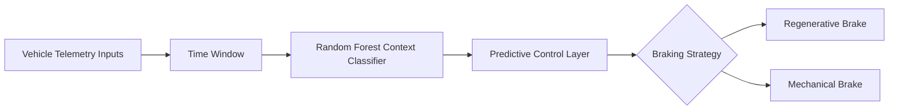

# Intelligent Adaptive Braking System Based on Telemetry and Driving Cycle Inference

This project defines the design of a braking system that adapts its behavior to the actual driving context using telemetry already available inside the vehicle, without relying on costly external sensors. The objective is not limited to improving a single braking function. The broader goal is to establish a technically rigorous foundation for a smarter, more efficient, and more commercially viable control strategy for entry-level electric and hybrid vehicles.

## The Problem

Predictive regenerative braking, in its most advanced form, remains largely reserved for premium vehicle platforms. In practice, its performance often depends on expensive architectures that combine vision, radar, continuous localization, and assistance suites designed to anticipate the driving environment with a high degree of complexity and a significant implementation cost.

That approach leaves out a much larger market segment: entry-level electric and hybrid vehicles that, despite their growing global adoption, continue to operate with essentially static braking strategies. The result is reduced efficiency in urban driving, less effective management of recoverable energy, and greater wear on mechanical and electrical components when the strategy does not adapt to the vehicle's real operating conditions.

## The Proposal

The proposal is to democratize adaptive braking through inference based on internal telemetry, eliminating dependence on expensive external hardware. Instead of attempting to perceive the environment through additional sensors, the system seeks to recognize driving patterns from the vehicle's dynamic behavior and from operational variables already available on the platform.

The technical value of this approach lies in its cost-benefit profile. By combining state estimation, context recognition, and braking allocation inside a compact control chain, the system can be designed as a lighter, more scalable solution that remains aligned with the industrial reality of high-volume vehicles. The aim is to capture much of the value of a premium predictive strategy without transferring its full complexity into the vehicle.

## Data Acquisition Pipeline

The dataset used in this project was not treated as a static download artifact. Instead, it was assembled through a controlled extraction pipeline built in two Python scripts, designed to preserve the fidelity of the original vehicle telemetry while selecting only the platforms relevant to the study.

The first script interacts with the Hugging Face hub to retrieve the `database.json` manifest from the `commaai/commaCarSegments` dataset. From that manifest, it filters the records and dynamically assembles the download paths for the `rlog.zst` files associated only with the vehicle platforms of interest, such as `CHEVROLET_BOLT` and `HYUNDAI_IONIQ_5`. This step ensures that the dataset remains focused on the operating conditions and vehicle classes that matter to the project, instead of mixing in unrelated segments that would add noise without improving the analysis.

The second script processes each compressed log by decompressing the `rlog.zst` files with `zstandard` and scanning the resulting binary stream directly. Rather than relying on a preprocessed intermediate layer, the script reads the raw memory segments and uses Python's native `struct` module to interpret the 64-bit structures used by the log format, which are organized through Cap'n Proto. From that low-level representation, the pipeline extracts the raw inertial telemetry required by the project, including `vEgo`, `aEgo`, and the brake pedal state.

This decision was intentional. By extracting telemetry at the byte level directly from real vehicle data, the downstream estimation filter and the context classifier are exposed to the authentic sensor noise, timing variability, and physical dynamics present in the source logs. That makes the resulting dataset more faithful to the operating environment than heavily preprocessed alternatives, and it gives the state estimator and classifier a better foundation for learning behavior that must remain valid in real driving conditions.

## Completed Milestones

The latest implementation cycle delivered four milestones that directly strengthened the reliability of the end-to-end pipeline.

The first milestone was signal purification. The initial telemetry extraction from the CAN data stream showed extreme noise and memory corruption artifacts that distorted the physical interpretation of braking events. We addressed this by implementing a 1D Kalman Filter in Python, which stabilized the velocity curve and restored physically coherent vehicle dynamics without requiring complex dependency compilation.

The second milestone was the data architecture baseline for MLOps. We established a strict separation policy where noisy source data remains immutable in `data/raw/`, while the purified dataset is exported to `data/processed/telemetria_lista_para_ml.csv` as the only modeling-ready artifact.

The third milestone was the definition of a lightweight dataset schema optimized for low-latency inference. The final dataset is intentionally compact and contains four kinematic variables: `timestamp_ns`, `velocidad_ms`, `aceleracion_long_m_s2`, and `freno_activo`.

The fourth milestone was a training protocol note linked to Issue 3. The `timestamp_ns` field is used exclusively as a temporal mold for ordering and feature derivation during feature engineering, but it must be strictly dropped before training the Random Forest and ONNX model. This prevents time-index leakage, reduces overfitting risk, and ensures the model learns braking kinematics rather than memorizing a timeline.

## Project Objective

The objective is to develop software capable of inferring, in real time, the dominant driving cycle of the vehicle and using that inference to dynamically adjust the balance between regenerative braking and mechanical braking.

The system logic begins with telemetry observed over bounded time windows. From those signals, the software must distinguish driving contexts that have direct implications for braking strategy, such as urban stop-and-go conditions, sustained cruise on open roads, emergency deceleration, or prolonged descents where energy recovery plays a different role. That inference must operate within the physical constraints of the storage system, especially battery state of charge and temperature, to avoid decisions that compromise safety, efficiency, or driving comfort.

## Development Approach

The project is organized into three complementary phases, each with a defined role in the technical chain. This structure is intended to separate data understanding, decision-making, and architectural validation in a way that allows the system to evolve with order and traceability.

The first phase focuses on telemetry analysis and dynamic state estimation. At this stage, real driving patterns will be examined to identify the statistical structure of the relevant signals, while the physical behavior of the braking system is modeled to recover dynamic variables that are not measured directly. This phase forms the foundation of the entire project because it defines which information has operational value and how it should be interpreted.

The second phase corresponds to the inference and control engine. Here, the system's central logic will be consolidated so that observed information can be transformed into braking decisions. A dedicated context classifier will identify the surrounding driving situation from temporal variations in the estimated dynamics, and the resulting context will guide the control policy. The expected behavior is smooth, coherent, and non-intrusive for the driver, avoiding abrupt or binary responses that could degrade the driving experience. The target is a controller that adjusts braking strategy with technical judgment and operational continuity.

The third phase covers system architecture and simulation. This stage is dedicated to structuring the control software in a stable, verifiable, and extensible way, while preserving the interaction between inputs, decisions, and outputs. It will also serve to represent integration as a functional component within a broader vehicle environment, allowing consistency, robustness, and deployment viability to be evaluated.

Within this stage, the estimator, the classifier, and the control layer are expected to operate as a single chain with low latency and deterministic behavior, so the system can react in real time without disrupting the driver's perception of braking smoothness.

## Expected Impact

From an energy perspective, the system is expected to increase energy recovery potential in routes where regenerative braking can be applied more intelligently, especially in urban contexts. That translates into better battery utilization and a more rational management of energy flow during driving.

From a mechanical perspective, the strategy aims to reduce unnecessary wear on friction elements by prioritizing electromagnetic retention more frequently when vehicle conditions allow it. This balance not only improves efficiency but also extends the service life of components directly exposed to wear.

From an industrial perspective, the project proposes a scalable software alternative for manufacturers and fleet operators seeking efficiency gains without redesigning the physical platform. This is especially relevant for existing mobility solutions, where a logical improvement in system behavior can deliver tangible value without requiring deep structural modifications.

## Repository Scope

This repository is intended to serve as the technical and documentary foundation of the project. Its purpose is to consolidate the system vision, organize its evolution, and establish the path for implementation, testing, and refinement.
The priority is to define the problem correctly, establish the functional boundaries of the system, and maintain a conceptual architecture that is clear enough to support the decisions that will follow.

## Value Perspective

The relevance of this work lies not only in automating a braking decision, but also in bringing operational intelligence to a domain where rigidity has historically dominated. If the system can infer the driving context accurately and respond with stability, it can become a practical path toward better efficiency, durability, and technological accessibility in the next generation of electrified vehicles.
